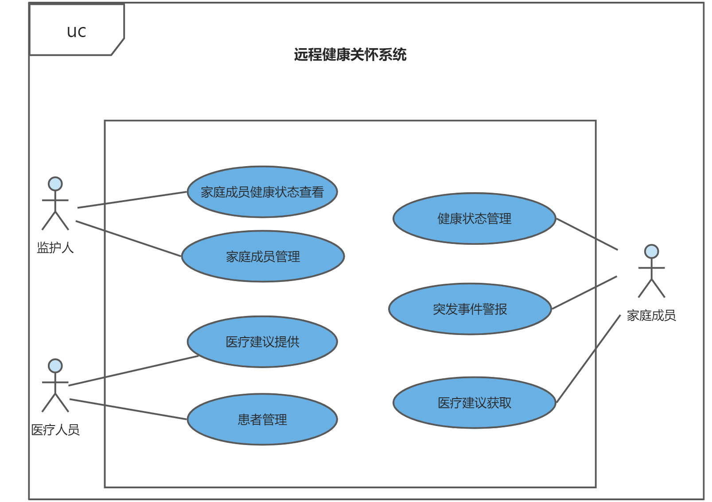

# 远程健康关怀系统

---

## 1. 客户提出的问题
随着医疗技术的发展和生活水平的提高，我国人口老龄化问题日益突出。传统家庭结构的变化，比如子女移居他处或离家工作，导致了对家中老人和孩童的远距离关爱需求增加。现代家庭生活的忙碌也导致了对家中孩童的监护时间不足。由于监护人的监护疏忽，老人在家中跌倒无人救助去世或落下残疾、孩童生病不善表达不适而贻误就诊的悲剧时有发生，酿成社会各方都不愿见到的惨剧。在这样的背景下，需要开发远程健康关怀系统从而有效避免这些问题的发生。对于这个系统客户还提出了一些需求：

1. 客户希望用户可以有效地进行远程监护

2. 客户希望使用该系统的用户愿意推荐该系统给其他人使用

3. 客户希望用户觉得系统给出的医疗建议有效

4. 客户希望用户觉得系统的突发事件警报很少误报

5. 客户希望用户觉得系统对突发事件响应及时

6. 客户希望用户觉得系统简单易用

## 2. 用例列表
|参与者|用例编号|用例名称|
|---|---|---|
|监护人|1|家庭成员健康状态查看|
||2|家庭成员管理|
|家庭成员|3|健康状态管理|
||4|突发事件警报|
||5|医疗建议获取|
|医疗人员|6|患者管理|
||7|医疗建议提供|

## 3. 用例图

## 4. 详细用例描述
|ID|1|
|---|---|
|名称|家庭成员健康状态查看|
|创建者|张宇|
|创建日期|2023-12-20|
|最后一次更新者|张宇|
|最后更新日期|2023-12-20|
|参与者|监护人|
|触发条件|监护人想要查看家庭成员的健康状态|
|前置条件|监护人已登录并且已在系统首页选择进入家庭成员健康状态查看界面|
|后置条件|无|
|优先级|中|
|正常流程|1.0 查看家庭成员列表|
||&ensp;1. 监护人查看家庭成员列表|
||&ensp;2. 系统显示监护人管理的家庭成员列表|
||1.1 健康状态总览查看|
||&ensp;1. 监护人选择家庭成员列表的一位成员|
||&ensp;2. 系统显示监护人所选择家庭成员的当日健康状态总览|
||1.2 历史健康状态查看|
||&ensp;1. 监护人选择查看历史健康状态|
||&ensp;2. 系统显示该家庭成员所拥有的健康状态数据的时间段，默认为查看当日|
||3.监护人选择时间段|
||4.系统显示该时间段内所选家庭成员的健康状态总览|
||1.3详细健康数据查看|
||1.监护人选择查看详细健康数据|
||2.系统显示可选择的健康数据类型，包括心率、血压、呼吸率、体温等|
||3.监护人选择其中一项健康数据类型|
||4.系统显示时间段内的该健康数据类型的详细数据|
|扩展流程|1.0-1a.监护人取消查看家庭成员状态|
||1.系统返回主界面|
||1.1-1a.监护人取消查看所选择的家庭成员状态|
||1.系统返回家庭成员列表界面|
||1.2-1a.监护人取消查看历史健康状态|
||1.系统返回显示所选择家庭成员的健康状态总览|
||1.3-1a.监护人取消查看详细健康数据|
||1.系统返回显示所选择的时间段的家庭成员健康状态总览|
|特殊需求|无|

| ID             | 2                                                    |
| -------------- | ---------------------------------------------------- |
| 名称           | 家庭成员管理                                         |
| 创建者         | 张宇                                                 |
| 创建日期       | 2023-12-20                                           |
| 最后一次更新者 | 张宇                                                 |
| 最后更新日期   | 2023-12-20                                           |
| 参与者         | 监护人                                               |
| 触发条件       | 监护人想要管理自己的家庭成员                         |
| 前置条件       | 监护人已登录并且已在系统首页选择进入家庭成员管理界面 |
| 后置条件       | 无                                                   |
| 优先级         | 低                                                   |
| 正常流程       | 1.0 添加家庭成员                                     |
|                | 1.监护人选择添加家庭成员选项                         |
|                | &ensp;2. 系统显示填写家庭成员信息的界面              |
|                | 3.监护人输入新成员的相关信息并确认添加               |
|                | 4.系统显示监护申请发送成功界面                       |
|                | 1.1编辑家庭成员信息                                  |
|                | 1.监护人选择编辑家庭成员信息                         |
|                | 2.系统显示家庭成员列表                               |
|                | 3.监护人选择编辑家庭成员信息选项                     |
|                | 4.系统展示家庭成员信息编辑界面                       |
|                | 5.监护人修改所需信息并保存更改                       |
|                | 6.系统显示保存成功界面                               |
|                | 1.2删除家庭成员                                      |
|                | 1.监护人进入家庭成员列表                             |
|                | 2.系统显示家庭成员列表                               |
|                | 3.监护人选择需要删除的家庭成员                       |
|                | 4.系统从列表中删除相应的家庭成员并显示删除成功界面   |
| 扩展流程       | 1.0-3a.监护人取消添加家庭成员                        |
|                | 1.系统返回家庭成员列表界面                           |
|                | 1.0-3b.监护人添加的家庭成员不在系统数据库中          |
|                | 1.系统显示添加失败界面                               |
|                | 1.1-1a.监护人取消编辑家庭成员信息                    |
|                | 1.系统返回家庭成员列表界面                           |
|                | 1.2-1a.监护人取消删除家庭成员                        |
|                | 1.系统返回家庭成员列表界面                           |
| 特殊需求       | 监护人添加的家庭成员总数不超过50个                   |

| ID             | 3                                                            |
| -------------- | ------------------------------------------------------------ |
| 名称           | 健康状态管理                                                 |
| 创建者         | 张宇                                                         |
| 创建日期       | 2023-12-20                                                   |
| 最后一次更新者 | 张宇                                                         |
| 最后更新日期   | 2023-12-20                                                   |
| 参与者         | 家庭成员                                                     |
| 触发条件       | 家庭成员想要管理自己的健康状态信息                           |
| 前置条件       | 家庭成员已登录并且已在系统首页选择进入健康状态管理界面       |
| 后置条件       | 无                                                           |
| 优先级         | 中                                                           |
| 正常流程       | 1.0 健康状态上传                                             |
|                | 1.家庭成员选择上传健康状态选项                               |
|                | &ensp;2. 系统显示上传健康状态的界面                          |
|                | 3.家庭成员手动输入或通过绑定智能手表等设备上传健康数据       |
|                | 4.系统显示上传成功界面                                       |
|                | 1.1编辑健康状态信息                                          |
|                | 1.家庭成员选择编辑自己的健康状态信息                         |
|                | 2. 系统显示健康状态编辑界面                                  |
|                | 3.家庭成员编辑自己的健康状态信息并保存                       |
|                | 4.系统展示保存成功界面                                       |
| 扩展流程       | 1.0-1a. 家庭成员取消上传健康状态                             |
|                | 1.系统返回主界面                                             |
|                | 1.1-1a. 家庭成员取消编辑健康状态                             |
|                | 1.系统返回主界面                                             |
| 特殊需求       | 家庭成员上传或编辑的健康状态信息均要进行校验以防出现明显不合理的值 |

| ID             | 4                                                            |
| -------------- | ------------------------------------------------------------ |
| 名称           | 突发事件警报                                                 |
| 创建者         | 张宇                                                         |
| 创建日期       | 2023-12-20                                                   |
| 最后一次更新者 | 张宇                                                         |
| 最后更新日期   | 2023-12-20                                                   |
| 参与者         | 家庭成员                                                     |
| 触发条件       | 家庭成员想要发出突发事件警报或系统检测到了异常健康状态       |
| 前置条件       | 家庭成员已登录                                               |
| 后置条件       | 无                                                           |
| 优先级         | 高                                                           |
| 正常流程       | 1.0 主动发出突发事件警报                                     |
|                | 1.家庭成员选择发出突发事件警报                               |
|                | &ensp;2. 系统显示发出成功界面                                |
|                | 3.系统向添加了该家庭用户的监护人发出异常警报提醒推送以及对监护人设备进行震动、拨号 |
|                | 1.1被动发出突发事件警报                                      |
|                | 1.系统对通过绑定的智能手表等设备获取到的健康状态信息进行实时分析后，发现了明显突发事件 |
|                | 2.系统向添加了该家庭用户的监护人发出突发事件警报提醒推送以及对监护人设备进行震动、拨号 |
| 扩展流程       | 无                                                           |
| 特殊需求       | 突发事件警报发出到所有监护人接收到警报的时间差不超过3秒      |

| ID             | 5                                                      |
| -------------- | ------------------------------------------------------ |
| 名称           | 医疗建议获取                                           |
| 创建者         | 张宇                                                   |
| 创建日期       | 2023-12-20                                             |
| 最后一次更新者 | 张宇                                                   |
| 最后更新日期   | 2023-12-20                                             |
| 参与者         | 家庭成员                                               |
| 触发条件       | 家庭成员想要获取医疗建议                               |
| 前置条件       | 家庭成员已登录并且已在系统首页选择进入医疗建议获取界面 |
| 后置条件       | 无                                                     |
| 优先级         | 低                                                     |
| 正常流程       | 1.0 获取医疗建议                                       |
|                | 1.家庭成员选择获取医疗建议选项                         |
|                | &ensp;2.系统显示医疗建议类型列表                       |
|                | 3.家庭成员选择一种类别的医疗建议                       |
|                | 4.系统显示获取申请成功界面                             |
|                | 5.系统向添加了该家庭成员的医疗人员发送医疗建议获取申请 |
| 扩展流程       | 1.0-3a.监护人取消获取医疗建议                          |
|                | 1.系统返回主界面                                       |
| 特殊需求       | 无                                                     |

| ID             | 6                                                      |
| -------------- | ------------------------------------------------------ |
| 名称           | 医疗建议提供                                           |
| 创建者         | 张宇                                                   |
| 创建日期       | 2023-12-20                                             |
| 最后一次更新者 | 张宇                                                   |
| 最后更新日期   | 2023-12-20                                             |
| 参与者         | 医疗人员                                               |
| 触发条件       | 医疗人员想要提供医疗建议                               |
| 前置条件       | 医疗人员已登录并且已在系统首页选择进入医疗建议提供界面 |
| 后置条件       | 无                                                     |
| 优先级         | 低                                                     |
| 正常流程       | 1.0 提供医疗建议                                       |
|                | 1.医疗人员选择提供医疗建议选项                         |
|                | &ensp;2.系统显示该医疗人员接收到的医疗建议获取申请     |
|                | 3.医疗人员选择一份医疗建议获取申请                     |
|                | 4.系统显示医疗建议编辑界面                             |
|                | 5.医疗人员进行建议编辑并选择发送                       |
|                | 6.系统显示医疗建议发送成功界面                         |
|                | 7.系统向申请人发送医疗建议获取成功推送                 |
| 扩展流程       | 1.0-5a.医疗人员取消提供医疗建议                        |
|                | 1.系统返回主界面                                       |
| 特殊需求       | 无                                                     |

| ID             | 7                                                  |
| -------------- | -------------------------------------------------- |
| 名称           | 患者管理                                           |
| 创建者         | 张宇                                               |
| 创建日期       | 2023-12-20                                         |
| 最后一次更新者 | 张宇                                               |
| 最后更新日期   | 2023-12-20                                         |
| 参与者         | 医疗人员                                           |
| 触发条件       | 医疗人员想要管理自己的患者                         |
| 前置条件       | 医疗人员已登录并且已在系统首页选择进入患者管理界面 |
| 后置条件       | 无                                                 |
| 优先级         | 低                                                 |
| 正常流程       | 1.0 添加患者                                       |
|                | 1.医疗人员选择添加患者选项                         |
|                | &ensp;2. 系统显示填写患者信息的界面                |
|                | 3.医疗人员输入新成员的相关信息并确认添加           |
|                | 4.系统显示患者添加申请发送成功界面                 |
|                | 1.1编辑患者信息                                    |
|                | 1.医疗人员进入患者列表                             |
|                | 2.系统显示患者列表                                 |
|                | 3.医疗人员选择编辑患者信息选项                     |
|                | 4.系统展示患者信息编辑界面                         |
|                | 5.医疗人员修改所需信息并保存更改                   |
|                | 6.系统显示保存成功界面                             |
|                | 1.2删除患者                                        |
|                | 1.医疗人员进入患者列表                             |
|                | 2.系统显示患者列表                                 |
|                | 3.医疗人员选择需要删除的患者                       |
|                | 4.系统从列表中删除相应的患者并显示删除成功界面     |
| 扩展流程       | 1.0-3a.医疗人员取消添加患者                        |
|                | 1.系统返回患者列表界面                             |
|                | 1.0-3b.医疗人员添加的患者不在系统数据库中          |
|                | 1.系统显示添加失败界面                             |
|                | 1.1-1a.医疗人员取消编辑患者信息                    |
|                | 1.系统返回患者列表界面                             |
|                | 1.2-1a.医疗人员取消删除患者                        |
|                | 1.系统返回患者列表界面                             |
| 特殊需求       | 医疗人员添加的患者总数不超过300个                  |

